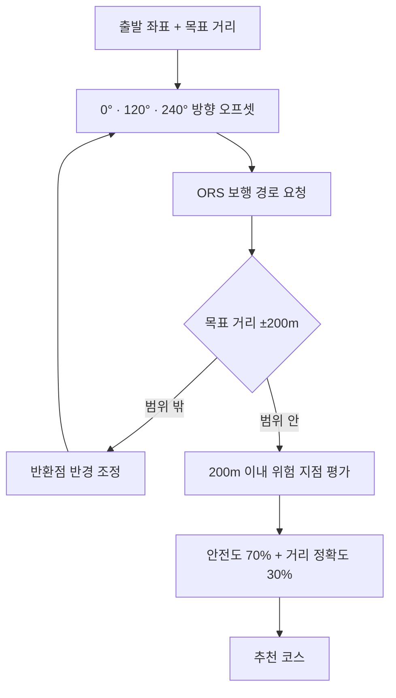
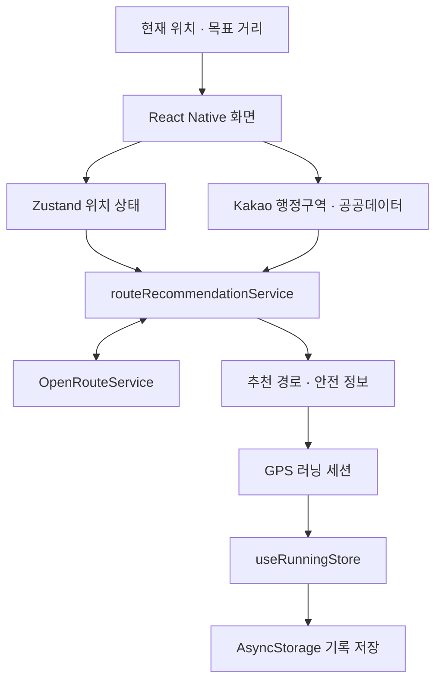

# RUN Guard

> 현재 위치와 목표 거리로 왕복 코스를 만들고, 사고 이력 기반 안전도와 거리 정확도를 비교하는 Android 러닝 앱입니다.

공모전 MVP의 코스 추천과 코치는 학습형 AI가 아닌 규칙·점수 기반으로 동작합니다.

## 개발 배경

직접 러닝을 하면서 집 주변에 정해진 코스가 부족하다는 점을 느꼈습니다. 외곽에서는 원하는 거리를 맞추기 어렵고, 야간이나 익숙하지 않은 장소에서는 안전 정보도 확인하기 힘들었습니다. 그래서 현재 위치와 목표 거리로 왕복 코스를 만들고 공개 사고 데이터를 함께 확인하는 앱을 개발했습니다. 포트폴리오와 2026 오픈소스 개발 공모전 출품을 위한 1인 프로젝트입니다.

## 주요 기능

| 기능 | 내용 |
| --- | --- |
| 왕복 코스 생성 | 현재 위치 또는 검색한 장소에서 5·7·10km 왕복 경로 후보를 생성합니다. |
| 안전도 분석 | 사고 다발지역과 경로 사이의 거리를 계산해 안전 점수와 주의 지점을 표시합니다. |
| GPS 러닝 세션 | 거리·시간·평균 페이스·남은 거리를 계산하고 일시정지와 재개를 처리합니다. |
| 기록 저장 및 분석 | 완료한 세션을 기기에 저장하고 경로, 구간 페이스와 상세 기록을 보여줍니다. |
| 러닝 코치 | 선택한 러너 급수와 주간 기록을 바탕으로 목표, 진행률과 배지를 관리합니다. |

## 코스 추천 및 안전도 평가 방식



기준 방위각에서 `0°`, `120°`, `240°`만큼 떨어진 세 방향의 반환점 후보를 만듭니다. ORS 경로가 목표 거리의 `±200m` 안에 들지 않으면 반경을 조정하며 최대 3회 시도합니다.

공공데이터 위험 지점과 경로 선분 사이의 최단거리를 구해 `200m` 이내 지점만 반영합니다. 거리, 사고 건수, 사망·중상 건수로 안전 점수를 차감하고 `안전도 70% + 거리 정확도 30%`로 후보를 정렬합니다. 안전 데이터가 없으면 거리 정확도만 사용합니다.

후보가 모두 실패하면 ORS 기본 왕복 경로를 한 번 요청하며, 이 경로도 `±200m` 조건을 적용합니다. 위 수치는 MVP 초기 휴리스틱이며 실험으로 최적화한 기준은 아닙니다.

핵심 구현:

- `src/services/routing/routeRecommendationService.ts`
- `src/services/safety/routeSafetyService.ts`

## GPS 러닝 세션 처리 방식

GPS 흔들림과 위치 점프로 기록이 부풀지 않도록 다음 조건을 적용했습니다.

- 정확도가 `50m`를 초과한 좌표는 제외
- 좌표 사이의 계산 속도가 `15m/s`를 초과한 구간은 제외
- `2m` 미만 이동은 거리에서 제외
- 수신 간격이 `10초`를 초과한 구간은 거리 미누적
- 일시정지한 시간은 전체 러닝 시간에서 제외
- 유효 위치가 15초 이상 갱신되지 않으면 GPS 신호 안내 표시

음성 안내는 `Expo Speech` 호출까지 연결되어 있습니다. 러닝 시작·일시정지·재개·종료, 회전 지점 약 300m 전과 80m 이내, 위험 지점 100m 이내, 1km 단위 누적 거리, 목표까지 500m·100m, 목표 달성을 안내합니다.

핵심 구현:

- `src/features/running/hooks/useRunningSession.ts`
- `src/features/running/utils/runningSessionCalculations.ts`
- `src/stores/useRunningStore.ts`
- `src/features/running/hooks/useRunningVoiceGuide.ts`
- `src/features/running/services/runningVoiceGuide.ts`

## 시스템 구조



`services`에서 외부 API 응답 정규화와 추천 점수 계산을 처리합니다. 러닝 세션은 Zustand로 관리하고 완료한 기록만 AsyncStorage에 저장합니다. 별도 서버는 사용하지 않습니다.

## 기술 스택과 프로젝트 구조

| 구분 | 기술 |
| --- | --- |
| 모바일 | React Native 0.86, TypeScript 6, Expo SDK 57 |
| 지도 | MapLibre React Native, OpenFreeMap |
| 상태·저장 | Zustand 5, AsyncStorage |
| 위치·음성 | Expo Location, Expo Speech |
| 경로·장소 | OpenRouteService, Kakao Local API |
| 안전 데이터 | 공공데이터포털 보행노인 교통사고 다발지역 API |
| 빌드 | Expo Development Build, EAS Build |

```text
run-guard/
├── src/
│   ├── app/          # 앱 진입점과 Provider
│   ├── features/     # 지도, 러닝, 기록, 코치, 설정 UI와 로직
│   ├── navigation/   # 화면 스택과 타입
│   ├── screens/      # 화면 단위 컴포넌트
│   ├── services/     # 외부 API, 경로 추천, 안전도 계산
│   ├── stores/       # 위치·러닝·코치 상태와 저장
│   ├── types/        # 공통 타입
│   └── utils/        # 공통 유틸리티
├── app.json
├── eas.json
├── package.json
└── tsconfig.json
```

## 로컬 실행

Node.js 24, npm 11, Java 17과 Android Studio 환경에서 실행했습니다. MapLibre 때문에 Expo Go가 아닌 development build 또는 로컬 네이티브 빌드가 필요합니다.

```bash
cd run-guard
npm ci
cp .env.example .env
```

발급받은 키를 `.env`에 입력합니다.

```dotenv
EXPO_PUBLIC_ORS_API_KEY=
EXPO_PUBLIC_KAKAO_REST_API_KEY=
EXPO_PUBLIC_OLDMAN_ACCIDENT_API_KEY=
```

Android 에뮬레이터 또는 USB 디버깅 기기를 연결해 실행합니다.

```bash
npm run android
```

Development build가 설치되어 있다면 `npm start`로 Metro만 실행할 수 있습니다. 타입 검사 명령은 다음과 같습니다.

```bash
npm run typecheck
```

`EXPO_PUBLIC_*` 값은 앱 번들에서 확인할 수 있으므로 API 제공자의 호출 제한과 허용 플랫폼 설정이 필요합니다. 실제 키가 담긴 `.env`는 커밋하지 않습니다.

## 실제 구현 범위 및 제한사항

구현한 범위는 다음과 같습니다.

- 현재 위치 권한, 좌표 취득과 장소 검색
- 5·7·10km 목표 거리 선택
- 세 방향 왕복 후보 생성, ORS 연동과 실패 처리
- 목표 거리 검증, 반환점 반경 조정과 후보 순위 계산
- 광명시 확인 후 사고 이력 기반 안전 점수·등급·경고 마커 표시
- foreground GPS 거리·시간·평균 페이스·남은 거리 계산
- 세션·회전·위험 지점·거리·목표 음성 안내
- AsyncStorage 기록 저장, 목록·상세 경로·구간 페이스 조회
- 러너 급수, 주간 목표, 진행률과 배지

현재 제한사항:

- **데이터 범위:** 2024년 경기도 광명시 보행노인 교통사고 다발지역만 사용합니다.
- **추천 방식:** 학습형 AI가 아닌 규칙·점수 기반입니다.
- **실행 범위:** Android와 foreground GPS를 중심으로 구현했습니다.
- **저장 방식:** 서버 없이 AsyncStorage에 기록을 저장합니다.
- **센서 범위:** 실제 심박·고도·케이던스·칼로리 센서는 연동하지 않았습니다.
- **플랫폼 범위:** iOS 실기기 검증, 회원가입과 서버 동기화는 제외했습니다.
- **미연동 데이터:** 실시간 교통, 공사, 도로 통제와 재해 예보는 사용하지 않습니다.
- **음성 설정:** 현재 페이스 안내와 0.5·1·2km 간격 설정은 저장되지만 실제 안내 로직에는 연결되지 않았습니다.
- **안전 정보:** 점수는 사고 이력을 바탕으로 한 참고 정보이며 실제 안전을 보장하지 않습니다. 광명시가 아니거나 행정구역 확인에 실패하면 `정보 없음`으로 표시합니다.

## 테스트

현재까지 수행한 검증입니다.

- `npm run typecheck`를 이용한 TypeScript 정적 타입 검사
- Android 에뮬레이터와 실제 Android 기기 실행
- 위치 권한, GPS 거리 누적, 일시정지·재개 수동 확인
- ORS와 공공데이터 API의 성공·실패 응답 수동 확인
- 기록 저장 후 앱 재실행 시 AsyncStorage 복원 확인

## 데이터와 외부 서비스

- [OpenRouteService](https://openrouteservice.org/): 보행 경로, 거리, 예상 시간과 회전 정보
- [Kakao Developers](https://developers.kakao.com/): 장소·행정구역·이미지 검색
- [공공데이터포털](https://www.data.go.kr/): 한국도로교통공단 보행노인 교통사고 다발지역
- [MapLibre](https://maplibre.org/): 오픈소스 지도 렌더링
- [OpenFreeMap](https://openfreemap.org/): 지도 스타일과 타일

외부 API와 데이터에는 각 제공자의 이용약관과 라이선스가 적용됩니다. 카카오 이미지 검색 결과는 앱에 저장하지 않고 원본 출처 링크를 함께 제공합니다.

## AI 활용 및 기술적 범위

앱에는 학습형 모델이나 추론 서버가 없습니다. 코스 추천은 거리와 안전 점수를 계산하는 휴리스틱이며, 코치는 러너 급수별 프리셋과 주간 기록 집계를 사용합니다.

개발 과정에서는 ChatGPT와 Codex를 기획 검토, 코드 작성·디버깅 보조, 문서화에 활용했습니다. 기능 범위 결정, 코드 반영과 실행 검증은 개발자가 직접 수행했습니다. 사용자 기록이 충분히 쌓이는 단계에서는 개인화 추천 모델 도입을 검토할 계획입니다.

## 로드맵

1. 전국 단위 안전 데이터와 실시간 도로 정보로 데이터 범위 확장
2. 사용자 기록을 반영한 개인화 추천과 서버 동기화
3. 백그라운드 GPS·웨어러블 연동 및 자동화 테스트 강화

## 기여

버그 제보와 개선 제안은 GitHub Issues로 남겨 주세요. 큰 변경은 구현 목적과 범위를 Issue에서 먼저 논의해 주세요.

## 라이선스

RUN Guard 소스 코드는 [MIT License](./LICENSE)로 공개합니다. 이미지, 지도, 외부 API 응답과 제3자 서비스에는 별도의 권리와 이용 조건이 적용될 수 있습니다.

## 개발자

김현성 · 기획, UX/UI, 모바일 개발과 데이터 연동을 담당한 1인 프로젝트
