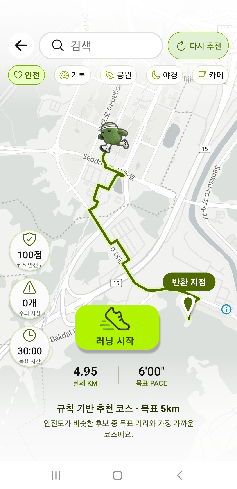
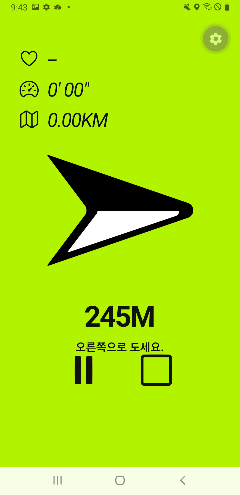
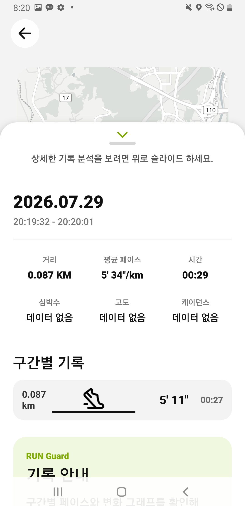
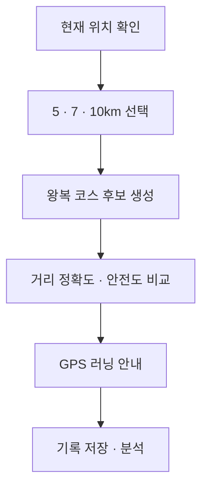
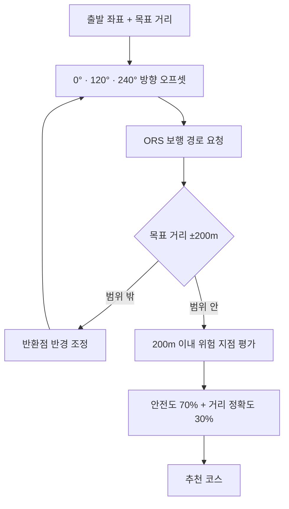
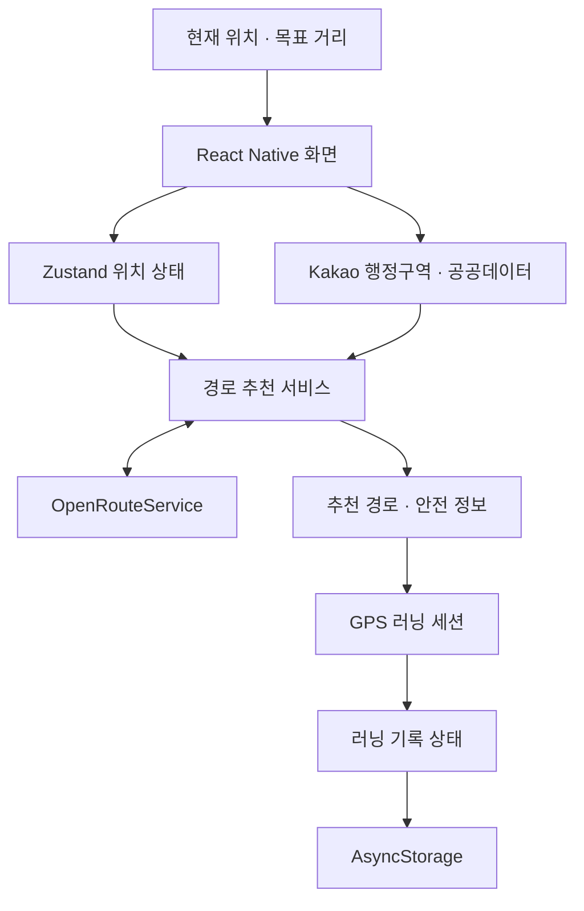

[README(6).md](https://github.com/user-attachments/files/30542693/README.6.md)
# RUN Guard

> GPS와 공공 안전 데이터를 결합해 사용자가 원하는 거리의 왕복 코스를 추천하는 안전 중심 맞춤형 러닝 내비게이션 앱

RUN Guard는 러닝 전에는 **목표 거리와 안전도를 함께 고려한 코스**를 제안하고, 러닝 중에는 **방향·남은 거리·위험 지점**을 직관적으로 안내하며, 러닝 후에는 **이동 경로와 페이스 기록**을 확인할 수 있도록 만든 Android 앱입니다.

현재 공모전 MVP의 코스 추천과 AI 코치는 학습형 모델이 아니라, 판단 근거를 확인할 수 있는 **규칙·점수 기반 방식**으로 동작합니다. 실시간 교통·공사·재해 데이터까지 통합하는 것이 최종 방향이며, 현재 버전에서는 그중 공공데이터포털의 사고 이력을 활용한 안전 경로 추천을 우선 구현했습니다.

## 앱 실행 화면

| 안전 코스 추천 | 실시간 러닝 안내 | 기록 분석 |
|---|---|---|
|  |  |  |

## 프로젝트 개요

| 항목 | 내용 |
| --- | --- |
| 프로젝트 형태 | 기획·UX/UI·모바일 개발·데이터 연동을 한 명이 수행한 1인 개발 프로젝트 |
| 개발 목적 | 정해진 러닝 코스가 부족한 지역에서도 사용자가 원하는 거리만큼 더 안전하게 달릴 수 있는 환경 제공 |
| 주요 사용자 | 집 주변에 러닝 트랙이나 산책로가 부족한 사람, 초행길·야간 도심에서 코스를 찾는 러너 |
| 핵심 기능 | 목표 거리 기반 왕복 코스 생성, 사고 이력 기반 안전도 평가, GPS 러닝 안내, 기록 분석, 주간 러닝 코치 |
| 구현 플랫폼 | Android 중심 React Native 애플리케이션 |
| 데이터 저장 | 별도 서버 없이 AsyncStorage를 이용한 기기 내 저장 |
| 공개 방식 | GitHub 소스 코드 공개 및 MIT License 적용 |

## 개발 배경과 제작 동기

러닝을 직접 하면서 가장 크게 느낀 불편은 **달릴 장소가 없는 것이 아니라, 현재 위치에서 얼마나 달려야 원하는 거리를 정확히 채울 수 있는지 알기 어렵다는 점**이었습니다. 공원이나 하천 산책로가 가까운 지역에서는 정해진 코스를 따라 달릴 수 있지만, 외곽 지역이나 일반 도심에서는 러너가 직접 길을 선택해야 합니다. 그 과정에서 목표 거리보다 지나치게 길거나 짧은 코스가 만들어지고, 막다른 길이나 익숙하지 않은 골목으로 들어가 다시 돌아오는 문제도 발생합니다.

안전 정보 역시 러너의 관점에서는 충분하지 않았습니다. 일반 지도 서비스는 최단 경로나 자동차 이동을 중심으로 정보를 제공하는 경우가 많고, 사고 다발지역·공사·재해와 같은 정보는 서로 다른 서비스에 흩어져 있습니다. 특히 야간이나 초행길에서는 러닝을 시작하기 전에 경로 주변의 위험 요소를 일일이 확인하기 어렵습니다. 달리는 도중에는 스마트폰 화면을 오래 볼 수도 없기 때문에, 단순히 지도에 경로를 그리는 것만으로는 실제 러닝 경험을 충분히 지원하기 어렵다고 판단했습니다.

이 문제를 해결하기 위해 RUN Guard를 기획했습니다. 사용자가 현재 위치와 `5km`, `7km`, `10km` 중 원하는 거리를 선택하면 여러 방향의 왕복 경로를 만든 뒤, **목표 거리와 얼마나 가까운지**, **사고 이력이 있는 위험 지점과 얼마나 떨어져 있는지**를 함께 비교합니다. 선택된 코스는 지도에 표시하고, 러닝 중에는 남은 거리와 방향 정보를 크게 보여 주며 음성으로 주요 상황을 안내합니다.

이 프로젝트는 단순한 러닝 기록 앱을 만드는 데 목적이 있지 않습니다. 교통·공사·재해와 같은 도시 데이터를 러너의 실제 이동 경로에 결합해, 앞으로 다양한 지역에서 활용할 수 있는 **안전 중심 보행·러닝 내비게이션의 기술적 기반**을 만드는 것이 목표입니다. 또한 구현 코드를 오픈소스로 공개해 공공데이터를 활용한 안전 보행 서비스 개발에 참고할 수 있도록 했습니다.

## 개발 목적

1. **러닝 인프라의 지역 격차 완화**  
   전용 트랙이나 잘 정비된 산책로가 부족한 지역에서도 현재 위치를 기준으로 목표 거리에 맞는 코스를 만들 수 있도록 합니다.

2. **거리뿐 아니라 안전까지 고려한 경로 제안**  
   최단거리만 제공하는 방식에서 벗어나, 공공 안전 데이터와 경로의 공간적 관계를 계산해 상대적으로 더 안전한 후보를 우선 제안합니다.

3. **달리는 상황에 맞는 내비게이션 UX 제공**  
   러너가 작은 지도와 많은 텍스트를 계속 확인하지 않아도 되도록 방향, 남은 거리, 위험 안내를 크고 단순한 화면과 음성으로 전달합니다.

4. **공공데이터의 실용적 활용 가능성 검증**  
   단순 조회에 머무르기 쉬운 사고 데이터를 실제 사용자 경로 평가에 사용해, 도시 데이터를 생활 체육 서비스로 확장할 수 있는 가능성을 보여 줍니다.

5. **설명 가능하고 확장 가능한 오픈소스 구현**  
   추천 결과의 기준을 코드와 문서로 확인할 수 있게 만들고, 향후 전국 안전 데이터·실시간 도로 정보·개인화 모델을 추가할 수 있는 구조를 지향합니다.

## 앱 사용 흐름



1. 앱이 위치 권한을 요청하고 사용자의 현재 좌표를 가져옵니다.
2. 사용자는 현재 위치 또는 검색한 장소를 출발점으로 정하고 목표 거리를 선택합니다.
3. 앱은 서로 다른 방향에 반환점 후보를 만든 뒤 OpenRouteService에 보행 경로를 요청합니다.
4. 목표 거리 허용 범위에 들어온 후보를 사고 이력 기반 안전도와 거리 정확도로 평가합니다.
5. 가장 높은 점수를 받은 코스를 지도에 표시하고 안전 점수, 주의 지점, 예상 시간을 제공합니다.
6. 러닝을 시작하면 GPS 좌표를 받아 거리·시간·평균 페이스·남은 거리를 갱신합니다.
7. 러닝 종료 후 실제 이동 경로와 구간별 기록을 기기에 저장하고 기록 화면에서 다시 확인합니다.

## 핵심 차별점

| 일반적인 러닝 기록 기능 | RUN Guard의 접근 |
| --- | --- |
| 사용자가 이미 알고 있는 코스를 달린 뒤 기록 | 현재 위치에서 목표 거리에 맞는 왕복 코스를 먼저 생성 |
| 거리 또는 최단 경로 중심 | 거리 정확도와 사고 이력 기반 안전도를 함께 비교 |
| 러닝 중 작은 지도와 수치 확인 필요 | 방향·남은 거리 중심의 큰 화면과 음성 안내 |
| 기록 결과만 제공 | 코스 추천 → 러닝 안내 → 기록 분석까지 하나의 흐름으로 연결 |
| 추천 근거를 알기 어려움 | 안전도·거리 정확도와 적용 기준을 공개한 설명 가능한 규칙 기반 추천 |

## 주요 기능

### 1. 목표 거리 기반 왕복 코스 생성

사용자는 `5km`, `7km`, `10km` 중 원하는 러닝 거리를 선택할 수 있습니다. 앱은 출발점과 도착점을 동일하게 유지하면서 서로 다른 방향의 반환점 후보를 생성하고, OpenRouteService의 보행 경로 결과를 이용해 실제 도로망을 따라가는 왕복 코스를 구성합니다.

직선거리만으로 반환점을 고정하면 도로 구조에 따라 실제 경로가 목표 거리와 크게 달라질 수 있습니다. 이를 줄이기 위해 반환점 반경을 조정하며 재요청하고, 최종 경로 길이가 목표 거리의 `±200m` 안에 들어오는지 검증합니다. 한 방향의 경로가 실패해도 전체 추천이 중단되지 않도록 여러 후보와 대체 요청을 사용합니다.

### 2. 공공데이터 기반 안전도 분석

현재 MVP는 공공데이터포털의 **보행노인 교통사고 다발지역 데이터**를 활용합니다. 단순히 위험 지점을 지도 위에 표시하는 데서 끝내지 않고, 각 위험 지점과 추천 경로 사이의 최단거리를 계산해 해당 지점이 실제 러닝 코스에 영향을 주는지 판단합니다.

경로에서 `200m` 이내에 있는 지점만 평가에 포함하고, 경로와의 거리, 사고 건수, 사망·중상 건수에 따라 안전 점수를 차감합니다. 사용자는 추천 결과 화면에서 안전 점수와 주의 지점 수를 확인할 수 있으며, 위험 지점은 지도 마커로 표시됩니다.

### 3. 러닝 중 GPS 내비게이션

러닝이 시작되면 foreground 위치 추적을 통해 실제 이동 좌표를 수집합니다. 유효한 좌표만 누적해 이동 거리, 경과 시간, 평균 페이스, 목표까지 남은 거리를 계산합니다. 일시정지 중에는 시간과 거리를 누적하지 않고, GPS 수신이 불안정할 때는 사용자에게 상태를 알립니다.

러닝 중 화면은 스마트폰을 오래 보기 어려운 상황을 고려해 방향과 남은 거리를 크게 보여 주도록 설계했습니다. 경로의 회전 정보, 위험 지점 접근, 누적 거리와 목표 도달 상황은 음성 안내로도 전달합니다.

### 4. 러닝 기록 저장과 분석

러닝이 종료되면 세션의 시작·종료 시각, 실제 이동 거리, 평균 페이스, GPS 경로와 구간별 기록을 AsyncStorage에 저장합니다. 사용자는 기록 목록에서 과거 러닝을 선택해 지도 경로, 킬로미터별 페이스와 상세 지표를 다시 확인할 수 있습니다.

별도 로그인과 서버를 사용하지 않기 때문에 MVP에서는 개인 기록이 외부로 전송되지 않으며, 앱을 다시 실행해도 기기 안에 저장된 기록을 복원합니다.

### 5. 규칙 기반 AI 러닝 코치

AI 코치는 사용자가 처음 선택한 러너 수준과 주간 러닝 기록을 바탕으로 주간 목표, 달성 진행률과 배지를 보여 줍니다. 현재 버전은 생성형 AI가 운동 처방을 만드는 구조가 아니라, 미리 정의한 러너 수준별 기준과 실제 기록 집계를 결합하는 방식입니다.

이 방식은 데이터가 충분하지 않은 초기 MVP에서도 일관된 결과를 제공하고, 사용자가 어떤 조건으로 목표와 배지를 받았는지 확인하기 쉽다는 장점이 있습니다. 향후 러닝 기록이 충분히 쌓이면 사용자의 페이스, 선호 거리, 달성률과 회복 패턴을 반영하는 개인화 추천으로 확장할 계획입니다.

## 코스 추천 및 안전도 평가 방식



### 후보 생성

출발점에서 하나의 방향만 검색하면 도로 단절이나 API 실패 때문에 경로를 얻지 못할 수 있습니다. 이를 줄이기 위해 기준 방위각에서 `0°`, `120°`, `240°`만큼 떨어진 세 방향에 반환점 후보를 만듭니다. 각 후보는 출발점에서 반환점을 경유해 다시 출발점으로 돌아오는 보행 경로로 요청합니다.

### 거리 보정

도로망을 따라 계산한 실제 경로가 목표 거리의 `±200m` 안에 들지 않으면, 반환점까지의 반경을 조정하며 후보별로 최대 3회 다시 시도합니다. 모든 일반 후보가 실패하면 OpenRouteService의 기본 왕복 경로를 한 번 요청하며, 대체 경로에도 동일한 거리 조건을 적용합니다.

### 위험 지점 평가

공공데이터의 위험 좌표와 경로를 구성하는 각 선분 사이의 최단거리를 계산합니다. 경로에서 `200m`보다 멀리 떨어진 위험 지점은 점수에 반영하지 않습니다. 영향 범위 안에 있는 지점은 경로와 가까울수록, 사고 건수와 사망·중상 건수가 많을수록 더 큰 감점 요소가 됩니다.

### 최종 후보 선택

거리 조건을 통과한 후보는 `안전도 70% + 거리 정확도 30%`의 가중치로 비교합니다. 안전 데이터가 제공되지 않는 지역에서는 임의의 안전 점수를 만들지 않고 거리 정확도만으로 후보를 선택하며, 화면에는 안전 정보를 `정보 없음`으로 표시합니다.

이 기준은 실제 사용자 데이터로 학습한 값이 아니라 공모전 MVP에서 추천 가능성을 검증하기 위해 설정한 초기 휴리스틱입니다. 따라서 안전을 보장하는 절대 지표가 아니라, 동일한 조건에서 생성된 후보를 비교하기 위한 상대적인 기준으로 사용합니다.

핵심 구현:

- `src/services/routing/routeRecommendationService.ts`
- `src/services/safety/routeSafetyService.ts`

## GPS 러닝 세션 처리 방식

스마트폰 GPS는 건물, 날씨와 수신 환경에 따라 좌표가 순간적으로 튈 수 있습니다. 수신 좌표를 모두 거리로 합산하면 실제로 움직이지 않았는데도 기록이 늘어날 수 있기 때문에 다음 필터를 적용했습니다.

| 검사 조건 | 처리 이유 |
| --- | --- |
| 정확도가 `50m`를 초과한 좌표 제외 | 오차 범위가 너무 큰 위치가 경로에 포함되는 것을 방지 |
| 계산 속도가 `15m/s`를 초과한 구간 제외 | 러닝으로 보기 어려운 순간 위치 점프 제거 |
| `2m` 미만 이동 거리 제외 | 정지 상태의 미세한 GPS 흔들림 누적 방지 |
| 수신 간격이 `10초`를 초과한 구간 미누적 | 장시간 누락된 두 좌표를 직선으로 연결하는 오류 방지 |
| 일시정지 시간 제외 | 실제 운동 시간과 평균 페이스 왜곡 방지 |
| 15초 이상 유효 위치 미수신 시 안내 | 사용자가 GPS 상태를 인지할 수 있도록 처리 |

음성 안내는 `Expo Speech` 호출까지 연결되어 있습니다. 러닝 시작·일시정지·재개·종료, 회전 지점 약 300m 전과 80m 이내, 위험 지점 100m 이내, 1km 단위 누적 거리, 목표까지 500m·100m, 목표 달성을 안내합니다. 동일한 안내가 짧은 시간 안에 반복되지 않도록 안내 상태를 관리합니다.

핵심 구현:

- `src/features/running/hooks/useRunningSession.ts`
- `src/features/running/utils/runningSessionCalculations.ts`
- `src/stores/useRunningStore.ts`
- `src/features/running/hooks/useRunningVoiceGuide.ts`
- `src/features/running/services/runningVoiceGuide.ts`

## 러닝 상황을 고려한 UX 설계

- **한눈에 확인하는 정보 구조:** 러닝 중 가장 필요한 방향과 남은 거리를 화면 중심에 크게 배치했습니다.
- **코스 전체 확인:** 러닝 시작 전에는 출발점과 반환점, 전체 경로가 한 화면에 들어오도록 지도 영역을 조정할 수 있습니다.
- **위험 정보의 사전 제공:** 안전 점수와 주의 지점 수를 러닝 시작 전에 확인하고, 위험 지점은 지도에서 구분할 수 있습니다.
- **시각·음성 안내 병행:** 화면을 계속 보기 어려운 러닝 상황을 고려해 회전, 위험 지점과 거리 안내를 음성으로도 제공합니다.
- **중단 가능한 세션:** 일시정지·재개·종료 상태를 분리해 신호 대기나 휴식 시간이 기록에 그대로 포함되지 않도록 했습니다.
- **추천부터 회고까지 연결:** 코스를 고르는 화면, 달리는 화면, 종료 후 기록 화면을 하나의 사용자 흐름으로 구성했습니다.

## 시스템 구조



화면 컴포넌트가 외부 API를 직접 처리하지 않도록 역할을 나눴습니다.

- `features`는 지도, 러닝, 기록, 코치와 설정 등 기능 단위 UI와 상태 연결을 담당합니다.
- `services`는 외부 API 호출, 응답 형식 정규화, 경로 후보 생성과 안전 점수 계산을 담당합니다.
- `stores`는 현재 위치, 러닝 세션과 코치 상태를 관리합니다.
- `AsyncStorage`에는 완료된 러닝 기록과 사용자의 설정을 저장합니다.
- 별도 백엔드 서버나 데이터베이스는 사용하지 않습니다.

## 외부 데이터 처리 흐름

| 데이터·서비스 | 앱에서의 역할 | 처리 방식 |
| --- | --- | --- |
| Kakao Local API | 장소 검색과 현재 좌표의 행정구역 확인 | 검색 결과와 좌표 정보를 앱 내부 형식으로 변환 |
| OpenRouteService | 보행 경로, 거리, 예상 시간과 회전 정보 제공 | 여러 반환점 후보를 요청하고 거리 조건을 검증 |
| 공공데이터포털 | 사고 다발지역 좌표와 사고 통계 제공 | 광명시 대상 데이터를 정규화한 뒤 경로와의 거리 계산 |
| MapLibre | 경로, 시작·반환 지점과 위험 마커 렌더링 | GeoJSON 형태로 지도 레이어에 전달 |
| Expo Location | 러닝 중 현재 위치 좌표 수집 | 정확도·속도·이동 거리·수신 간격 조건으로 필터링 |

외부 API 응답 실패가 앱 전체 오류로 이어지지 않도록 경로 후보별 실패 처리와 안전 데이터 부재 상태를 분리했습니다. 안전 데이터를 가져오지 못한 경우에는 위험 정보가 있는 것처럼 추정하지 않고, 거리 조건을 기준으로 코스를 제안합니다.

## 기술 스택과 선택 이유

| 구분 | 기술 | 선택 이유 |
| --- | --- | --- |
| 모바일 | React Native 0.86, TypeScript 6, Expo SDK 57 | 하나의 TypeScript 코드베이스로 모바일 UI와 네이티브 위치 기능을 구현하고 타입 오류를 줄이기 위해 사용 |
| 지도 | MapLibre React Native, OpenFreeMap | 오픈소스 지도 렌더링 엔진과 공개 지도 스타일을 활용해 경로·마커를 자유롭게 표현 |
| 상태 관리 | Zustand 5 | 러닝 세션처럼 여러 화면이 공유하는 상태를 비교적 단순한 구조로 관리 |
| 로컬 저장 | AsyncStorage | 회원가입과 서버 없이도 기록과 설정을 기기에 유지하는 MVP 구현에 적합 |
| 위치·음성 | Expo Location, Expo Speech | foreground GPS 추적과 한국어 음성 안내를 Expo 환경에서 연결 |
| 경로·장소 | OpenRouteService, Kakao Local API | 보행 경로 생성과 국내 장소·행정구역 검색 역할을 분리 |
| 안전 데이터 | 공공데이터포털 보행노인 교통사고 다발지역 API | 실제 사고 이력을 경로 평가에 반영해 공공데이터 활용 가능성을 검증 |
| 빌드 | Expo Development Build, EAS Build | MapLibre 네이티브 모듈을 포함한 Android 개발·배포 빌드를 생성 |

## 개발 환경

| 항목 | 환경 |
| --- | --- |
| 개발 기기 | Apple Silicon MacBook |
| 운영체제 | macOS |
| 런타임 | Node.js 24, npm 11 |
| Android 도구 | Java 17, Android Studio, Android SDK·ADB |
| 개발 언어 | TypeScript |
| 테스트 환경 | Android Studio 에뮬레이터 및 실제 Android 기기 |
| 배포 빌드 | EAS Build의 Android internal distribution |
| 버전 관리 | Git, GitHub |

MapLibre는 네이티브 모듈을 사용하므로 Expo Go만으로는 실행할 수 없습니다. 프로젝트 전용 development build 또는 로컬 Android 네이티브 빌드가 필요합니다.

## 프로젝트 구조

```text
run-guard/
├── src/
│   ├── app/          # 앱 진입점과 Provider
│   ├── features/     # 지도, 러닝, 기록, 코치, 설정 UI와 로직
│   ├── navigation/   # 화면 스택과 타입
│   ├── screens/      # 화면 단위 컴포넌트
│   ├── services/     # 외부 API, 경로 추천, 안전도 계산
│   ├── stores/       # 위치·러닝·코치 상태와 저장
│   ├── types/        # 공통 타입
│   └── utils/        # 공통 유틸리티
├── app.json
├── eas.json
├── package.json
└── tsconfig.json
```

## 로컬 실행

```bash
cd run-guard
npm ci
cp .env.example .env
```

각 서비스에서 발급받은 키를 `.env`에 입력합니다.

```dotenv
EXPO_PUBLIC_ORS_API_KEY=
EXPO_PUBLIC_KAKAO_REST_API_KEY=
EXPO_PUBLIC_OLDMAN_ACCIDENT_API_KEY=
```

Android 에뮬레이터 또는 디버깅 기기를 연결해 실행합니다.

```bash
npm run android
```

Development build가 설치되어 있다면 `npm start`로 Metro만 실행할 수 있습니다. 타입 검사 명령은 다음과 같습니다.

```bash
npm run typecheck
```

`EXPO_PUBLIC_*` 환경 변수는 앱 번들에서 확인할 수 있으므로 비밀 서버 키를 저장하는 용도로 사용하면 안 됩니다. 각 API 제공자의 호출 제한과 허용 플랫폼 설정을 적용하고, 실제 키가 담긴 `.env`는 Git에 커밋하지 않습니다.

## 실제 구현 범위

- 현재 위치 권한 요청, 좌표 취득과 장소 검색
- `5km`, `7km`, `10km` 목표 거리 선택
- 세 방향 왕복 후보 생성, OpenRouteService 연동과 후보별 실패 처리
- 목표 거리 `±200m` 검증, 반환점 반경 조정과 후보 순위 계산
- 광명시 행정구역 확인 후 사고 이력 기반 안전 점수·등급·경고 마커 표시
- foreground GPS 거리·시간·평균 페이스·남은 거리 계산
- 세션 상태·회전·위험 지점·누적 거리·목표 도달 음성 안내
- AsyncStorage 기록 저장, 기록 목록·상세 경로·구간 페이스 조회
- 러너 수준 선택, 주간 목표·진행률과 배지 관리
- Android development build와 internal distribution APK 생성

## 현재 제한사항

- **데이터 범위:** 2024년 경기도 광명시 보행노인 교통사고 다발지역 데이터만 사용합니다.
- **추천 방식:** 사용자 데이터로 학습한 모델이 아닌 규칙·점수 기반 추천입니다.
- **실행 범위:** Android와 foreground GPS를 중심으로 구현했습니다.
- **저장 방식:** 서버 없이 AsyncStorage에 기록을 저장하므로 기기 간 동기화는 지원하지 않습니다.
- **센서 범위:** 실제 심박·고도·케이던스·칼로리 센서는 연동하지 않았습니다.
- **플랫폼 범위:** iOS 실기기 검증, 회원가입과 백엔드 동기화는 제외했습니다.
- **미연동 데이터:** 실시간 교통, 공사, 도로 통제와 재해 예보는 현재 MVP에 연결하지 않았습니다.
- **음성 설정:** 현재 페이스 안내와 0.5·1·2km 간격 설정은 저장되지만 실제 안내 로직에는 아직 연결되지 않았습니다.
- **안전 정보:** 점수는 사고 이력을 이용한 후보 간 비교 지표이며 실제 안전을 보장하지 않습니다.
- **지역 판별:** 광명시가 아니거나 행정구역 확인에 실패하면 안전도를 임의로 계산하지 않고 `정보 없음`으로 표시합니다.

실시간 도시 데이터 전체가 이미 연동된 것처럼 표현하지 않기 위해, 현재 동작하는 기능과 향후 확장 기능을 구분해 공개합니다.

## 테스트

현재까지 다음 항목을 수동 검증했습니다.

- `npm run typecheck`를 이용한 TypeScript 정적 타입 검사
- Android 에뮬레이터와 실제 Android 기기 실행
- 위치 권한 허용·거부와 현재 좌표 취득 확인
- GPS 거리 누적, 일시정지·재개·종료 상태 확인
- OpenRouteService와 공공데이터 API의 성공·실패 응답 확인
- 목표 거리 조건 및 경로 후보 실패 시 대체 처리 확인
- 안전 점수, 주의 지점과 지도 마커 표시 확인
- 기록 저장 후 앱 재실행 시 AsyncStorage 복원 확인
- EAS Build를 이용한 독립 실행 Android APK 동작 확인

## 데이터와 외부 서비스

- [OpenRouteService](https://openrouteservice.org/): 보행 경로, 거리, 예상 시간과 회전 정보
- [Kakao Developers](https://developers.kakao.com/): 장소·행정구역·이미지 검색
- [공공데이터포털](https://www.data.go.kr/): 한국도로교통공단 보행노인 교통사고 다발지역
- [MapLibre](https://maplibre.org/): 오픈소스 지도 렌더링
- [OpenFreeMap](https://openfreemap.org/): 지도 스타일과 타일

외부 API와 데이터에는 각 제공자의 이용약관과 라이선스가 적용됩니다. 카카오 이미지 검색 결과는 앱에 저장하지 않고 원본 출처 링크를 함께 제공합니다.

## AI 활용 및 기술적 범위

### 앱 내부의 AI 활용

현재 앱에는 별도의 학습형 모델이나 추론 서버가 없습니다. 코스 추천은 여러 후보를 생성하고 거리·안전 점수를 계산하는 휴리스틱이며, AI 코치는 러너 수준별 프리셋과 주간 기록 집계를 사용합니다.

초기 사용자 데이터가 없는 상황에서 근거를 설명하기 어려운 모델을 적용하기보다, 어떤 조건으로 코스가 선택됐는지 확인할 수 있는 규칙 기반 구조를 먼저 구현했습니다. 이는 향후 실제 러닝 기록과 위험 데이터를 수집했을 때 개인화 모델과 비교할 수 있는 기준선 역할도 합니다.

### 개발 과정의 AI 활용

개발 과정에서는 ChatGPT와 Codex를 다음 작업의 보조 도구로 활용했습니다.

- 사용자 문제와 MVP 기능 범위 검토
- React Native·TypeScript 코드 초안 작성과 리팩터링
- 지도, GPS, 외부 API와 Android 빌드 오류 원인 분석
- 반복 테스트 결과를 바탕으로 한 수정 항목 정리
- README와 결과보고서 등 기술 문서 작성

앱의 문제 정의, 기능 우선순위, UX/UI 결정, 외부 API 선택, 실제 코드 반영, 에뮬레이터·기기 테스트와 최종 검증은 개발자가 직접 수행했습니다. AI가 생성한 결과를 그대로 사용하는 것이 아니라, 실행 결과를 확인하고 오류와 요구사항을 다시 전달하며 반복적으로 수정했습니다.

## 기대 효과

### 시민의 안전한 운동 환경 조성

사고 이력과 향후 연동할 실시간 도시 위험 요소를 경로 선택 전에 제공하면, 러너와 보행자가 위험 가능성이 높은 구간을 사전에 인지하고 우회하는 데 도움을 줄 수 있습니다. 특히 초행길이나 야간처럼 주변 정보를 판단하기 어려운 상황에서 활용 가치가 있습니다.

### 공공데이터의 실용적 활용 확대

교통·공사·재해 데이터는 조회 화면만 제공할 때보다 사용자의 실제 위치와 이동 경로에 결합될 때 더 직접적인 가치를 만들 수 있습니다. RUN Guard는 공공데이터의 좌표와 경로 사이의 공간 관계를 계산해 추천 결과에 반영하는 활용 사례를 제시합니다.

### 지역 체육 활동 접근성 향상

잘 알려진 러닝 코스가 없는 지역에서도 목표 거리에 맞는 왕복 경로를 만들 수 있다면 러닝을 시작하기 위한 장소 제약을 줄일 수 있습니다. 장기적으로는 이용 기록을 바탕으로 지역의 안전한 보행로와 새로운 러닝 구간을 발견하는 데도 활용할 수 있습니다.

### 오픈소스 생태계 기여

경로 후보 생성, 거리 보정, GPS 필터링과 공공 안전 데이터 결합 과정을 공개함으로써 유사한 안전 보행·교통 서비스 개발자가 구조와 코드를 참고할 수 있습니다. 이슈와 개선 제안을 통해 데이터 범위와 알고리즘을 함께 발전시키는 선순환을 기대합니다.

## 향후 로드맵

1. 전국 단위 사고·범죄·보행 안전 데이터로 서비스 지역 확대
2. 실시간 공사, 도로 통제, 교통과 재해 예보 API 연동
3. 사용자 기록을 반영한 개인화 코스·훈련 추천과 서버 동기화
4. 백그라운드 GPS, 웨어러블 심박·케이던스 연동
5. 다양한 기기와 지역을 대상으로 한 실외 테스트 및 자동화 테스트 강화

## 기여

버그 제보와 개선 제안은 GitHub Issues로 남겨 주세요. 큰 변경은 구현 목적과 범위를 Issue에서 먼저 논의해 주세요.

## 라이선스

RUN Guard 소스 코드는 [MIT License](./LICENSE)로 공개합니다. 이미지, 지도, 외부 API 응답과 제3자 서비스에는 별도의 권리와 이용 조건이 적용될 수 있습니다.

## 개발자

김현성 · 기획, UX/UI, 모바일 개발, 외부 데이터 연동과 테스트를 담당한 1인 프로젝트
